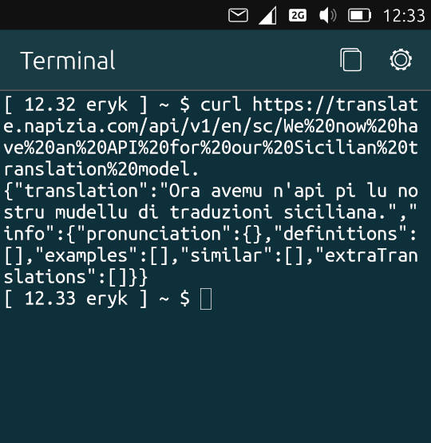
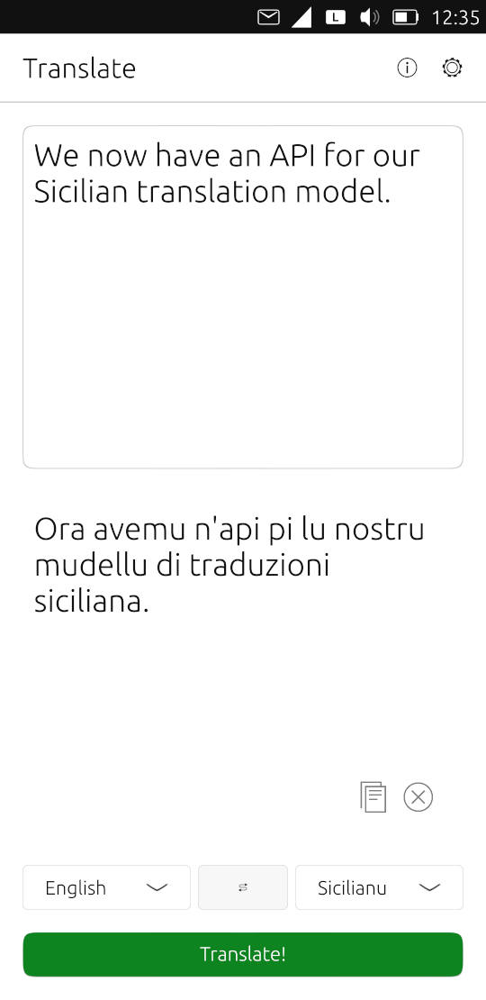
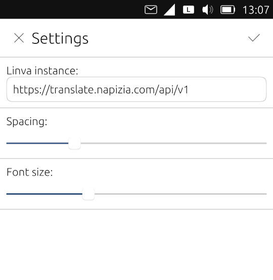

# napizia-api

API for the Napizia translator




##  limited use

This API provides limited access to Napizia's [Tradutturi Sicilianu](https://translate.napizia.com/).
Our model runs on a small server.  Please ask for assistance if you need a large number of translations.


##  specification

This API is based on and compatible with the
[Lingva Translate API](https://github.com/TheDavidDelta/lingva-translate):

+ GET `/api/v1/:source/:target/:query`
```typescript
{
    "translation": "string with requested translation"
    "info": (unused)
}
```

+ GET `/api/v1/languages
```typescript
{
    "languages": [
        {
            "code": "en"
            "name": "English"
        }
        {
            "code": "it"
            "name": "Italiano"
        }
        {
            "code": "sc"
            "name": "Sicilianu"
        }
    ]
}
```


##  example

Our API can be used with
[translate-ut](https://github.com/walking-octopus/translate-ut/),
a translation app for Ubuntu Touch:




